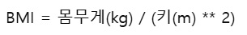

# 파이썬 기초 실습 문제

기본 문법을 복습하면서 재미있게 만들어볼 수 있는 프로그램 문제입니다.  
아래 문제들을 직접 코드로 작성해 보세요.

---

## 📌 1번. 숫자 맞추기 게임
**설명:**  
컴퓨터가 1부터 100 사이의 숫자 하나를 랜덤으로 정합니다.  
사용자는 숫자를 입력하며 컴퓨터가 정한 값을 맞춰야 합니다.  

- 입력한 숫자가 정답보다 작으면 `"업!"`  
- 입력한 숫자가 정답보다 크면 `"다운!"`  
- 정답을 맞추면 `"정답! 시도 횟수: n회"`라고 출력하고 프로그램을 종료합니다.  

**포인트 문법:**  
- `random` 모듈  
- `while` 반복문  
- `if-elif-else` 조건문  
- `input()`과 형변환(`int`)

---

## 📌 2번. 가위바위보 게임
**설명:**  
사용자가 `"가위"`, `"바위"`, `"보"` 중 하나를 입력하면,  
컴퓨터는 세 가지 중 하나를 랜덤으로 선택합니다.  
게임 결과를 비교해서 이겼는지, 졌는지, 비겼는지 알려주세요.  

**조건:**  
- 가위 vs 보 → 가위 승  
- 바위 vs 가위 → 바위 승  
- 보 vs 바위 → 보 승  
- 같은 선택 → 무승부  

**포인트 문법:**  
- 리스트와 `random.choice()`  
- 조건문(if)  
- 문자열 비교

---

## 📌 3번. BMI 계산기
**설명:**  
사용자의 키(cm)와 몸무게(kg)를 입력받아 BMI 지수를 계산합니다.  

BMI 공식은 다음과 같습니다:  

**출력 예시:**  
- BMI 값 (소수 둘째 자리까지)  
- 판정 결과:  
  - 18.5 미만 → 저체중  
  - 18.5 ~ 23 미만 → 정상  
  - 23 ~ 25 미만 → 과체중  
  - 25 이상 → 비만  

**포인트 문법:**  
- 수학 연산, 거듭제곱(`**`)  
- `if-elif-else` 조건문  
- 문자열 포맷팅(`f-string`)

---

## 📌 4번. 미니 은행 프로그램
**설명:**  
은행 입출금 기능을 가진 간단한 프로그램을 만드세요.  
프로그램은 메뉴를 보여주고, 사용자가 선택한 기능을 실행합니다.  

**메뉴:**  
1. 잔액 조회  
2. 입금  
3. 출금  
4. 종료  

**조건:**  
- 잔액은 처음에 0원으로 시작  
- 입금: 입력한 금액을 잔액에 더하기  
- 출금: 입력한 금액을 잔액에서 빼기 (단, 잔액보다 큰 금액은 불가능)  
- 종료: 프로그램 끝내기  

**포인트 문법:**  
- `while True` 반복문  
- 함수(`def`) 정의  
- 조건문  
- 변수 값 갱신(+=, -=)

